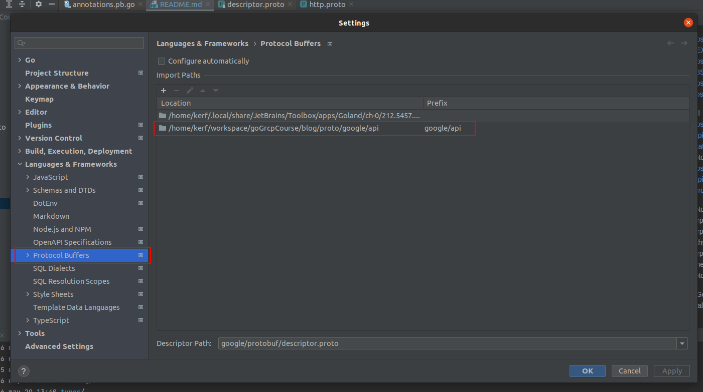
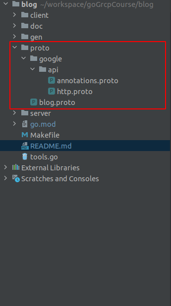

https://www.youtube.com/watch?v=EXqmRThU2ys&t=539s
https://www.youtube.com/watch?v=8SnC354B5Vc
https://github.com/grpc-ecosystem/grpc-gateway/tree/v1

curl https://raw.githubusercontent.com/googleapis/googleapis/master/google/api/annotations.proto > proto/google/api/annotations.proto
curl https://raw.githubusercontent.com/googleapis/googleapis/master/google/api/http.proto > proto/google/api/http.proto

protoc -I . --grpc-gateway_out ./gen/go \
--grpc-gateway_opt logtostderr=true \
--grpc-gateway_opt paths=source_relative \
--grpc-gateway_opt generate_unbound_methods=true \
proto/blog.proto

In Golang IDE to mind the imports of local protos (google downloaded files)

